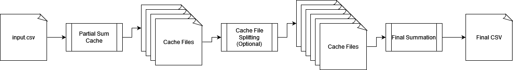
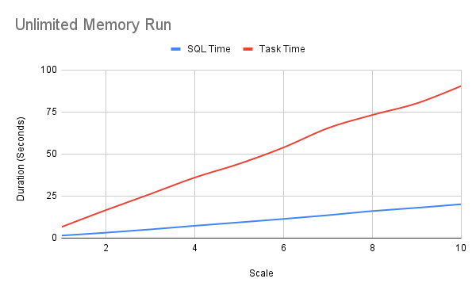
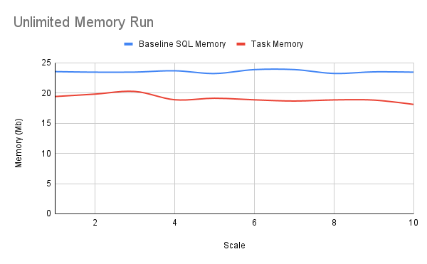
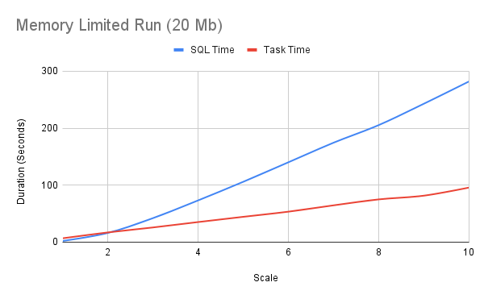
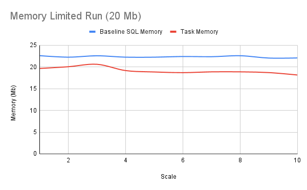
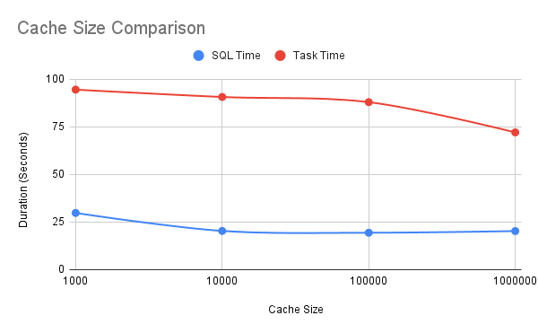
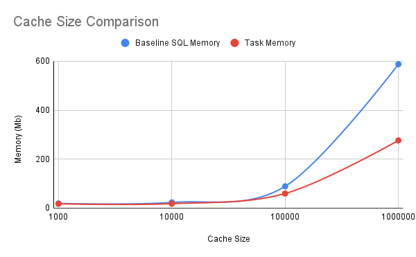

# Crisis Textline Market Basket Task
## Run Instructions
The solution was implemented in Python 3.12. To make it easier to run I've encapsulated it in a Dockerfile. I've provided some utility Makfile target to make building and running it easier. Each command below will ensure the Dockerfile is built before running.
```
make run # Run the test script
make inside # Start a bash session in the docker image
make data/data_#.csv # Run the data generation tool to generate a specific size of test data.
make clean # Clean up any cache data and output .csvs
```
## Implementation
Before starting on my implementation I wrote out a trivial baseline solution using sql to have a point of comparison when testing my own code. The SQL code configures the cache size to be similar to the cache size calculated in the main task solution so if I do well they should have similar performance.

### Approach
For this task the approach involves a three step process with a limited size cache at each stage.

#### Step 1
In the first stage rows are read until the basket id changes signifying the end of the basket. The item ids from those rows are used to calculate all two product pairs for the basket. Each item pair has its sum in the cache incremented if present or initialized to one. This process begins the aggregation of pair counts. The input may not all fit in the cache however so these are treated as partial sums.

When the cache reaches capacity the least recently used item pair count is cached to a file. The filename for the cache file is generated by masking off a number of bits from both item ids. By controlling how many bits contribute to the hash we can control the maximum amount of item pairs that will be cached to any given file. A balance of number of lines to number of files should be found so that neither one becomes unhandleable. This hash also ensures that all partial sums for a given pair end up in the same cache file.

#### Step 2
After all data has been read from the input file, the cache files are inspected to make sure that they will be able to fit in memory. If our hash in step 1 performed well then each cache file should have fewer lines in it than what will fit in memory. If the mask size was not configured well then some cache files may need to be split into smaller files. To do this the partial sums can be read a second time and similarly cached until memory fills. The num of masked off bits is decreased resulting in a larger hash space which results in more cache files being created.

Each time a cache file is split it should contain close to half the data it had before. This is not guaranteed, but some improvement to the hashing function could bring it closer. If a worse case scenario this could move the execution time of the program from linear to loglinear, but in practice the heuristic I used for the hash masks results in splits almost never happening.

#### Step 3
After step 2 the cache files should each be able to fit in memory and pair of items have all partial sums in a single file. The final summation of the partial sums can be done in one pass over each cache file. While reading a cache file each partial sum is aggregated into a dictionary and then the final counts are written to the output csv.

### Correctness
By ensuring that all partial sums end up in the same file and ensuring that all files can fit in memory correctness can be assumed because the whole sum is calculated in memory at once. In order to double check though I compared the results generated between the SQL baseline and the main task and both came up with the same result.

### Memory Constraints
Memory constraints are maintained by the fix sized cache. The way I have configured it is by num of log lines that can fit in memory at once, but if I were to redo it I think I would make it a specific quantity of memory instead. The test script is also run within a fixed memory size Docker container in order to ensure a max amount of memory is available.

### Productionization
This program is very much in a prototype state. The code could use some clean-up and I would want to implement unit tests to better cover functionality. Further testing of various data volumes and memory limitations would also be good. 

In reality I don't think I'd productize this approach, but instead use an existing system like Spark Streaming to process the data. If a bespoke solution was needed I would probably probably lean on Rust or Go for a performance critical application such as this.

### Hot Key Handling
If the data was generated so that the distribution of item ids was less uniform I think my system would still be able to handle it. In the worst case most keys would end up in the same cache file, but after the splitting it should be able to reduce the cache file to a reasonable size. To hit this case though the first and second item in each item tuple would need to end up in similar hash spaces. If this were the case it would also be more likely for the in memory cache to not evict those items to disk which would also help with performance.

## Runtime Performance
I expected to be able to implement this solution in linear time and based off my experiments it does appear to handle things somewhat linearly. I ran both the baseline SQL approach and the main task approach on data set scales from 1-10. In the first test they ran in a docker container that did not have a memory limit. As can be seen both approaches appear to grow at a linear rate with the SQL outperforming the main solution when container memory is not limited. When container memory is limited however the main approach does not have a performance change while the SQL approach takes considerably longer. I suspect the SQL approach is dumping to virtual memory more often in the limited case, but I have not tracked down the exact reason it performed worse at this time.

*Without Memory Limit*




*With 20mb memory limit*




I also ran each approach with a varying cache size on the data_10.csv file. Size of the cache did not have a major effect on the runtime, but when memory usage is compared the main task approach used consistently smaller amounts of memory than the SQL approach.

*Without memory limit*




## Future Things


### Triple Co-occurrence
To adapt this solution to occurrences of item triples I would need to adapt the hashing function to include more items and make the in-memory cache aware of the additional item in the tuple. The code is not currently very extensible in this way, but I think with some better encapsulation it could be refactored to be so.